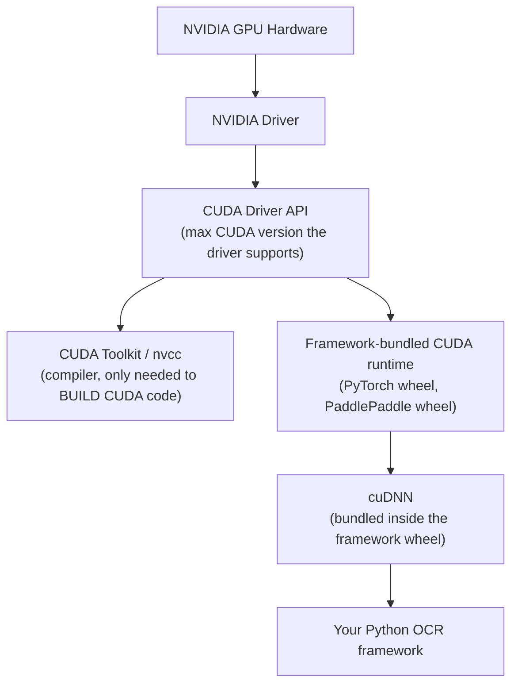
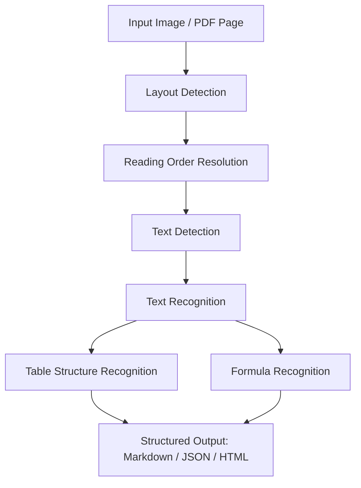
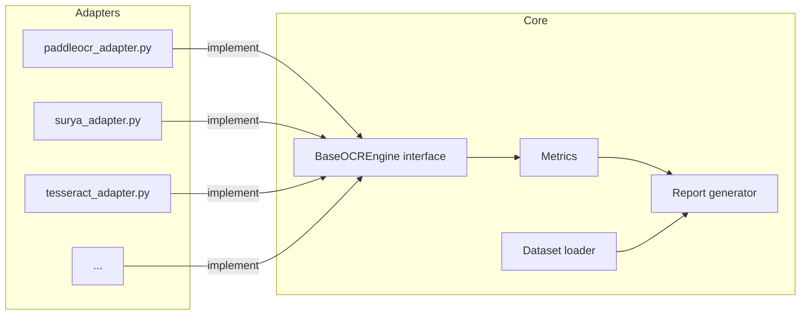
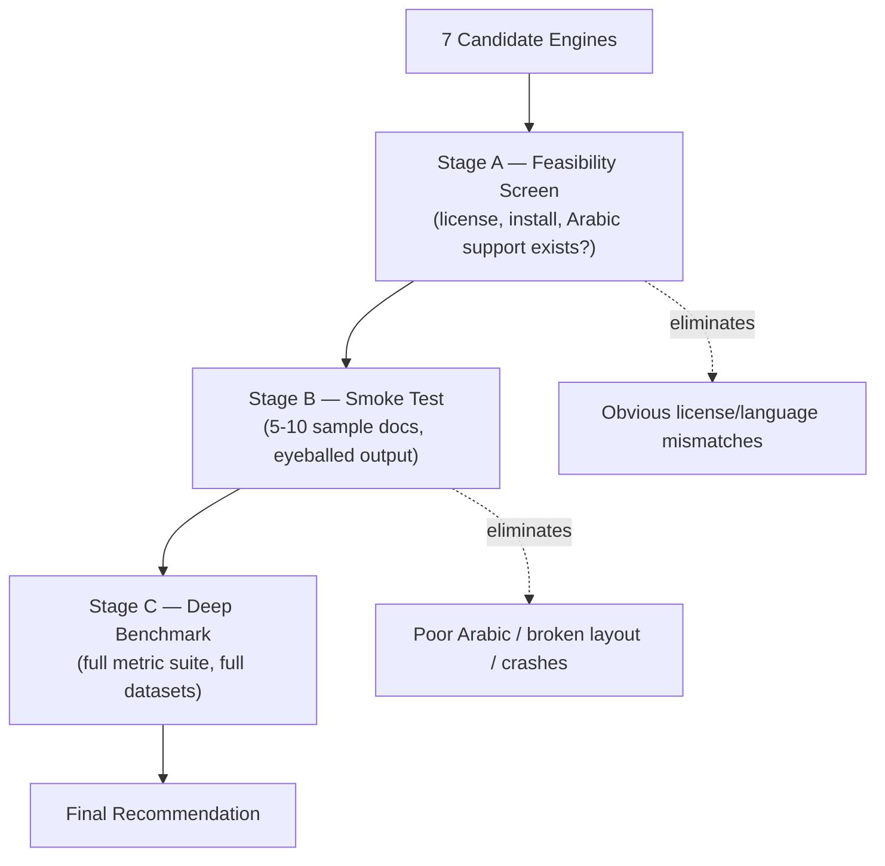
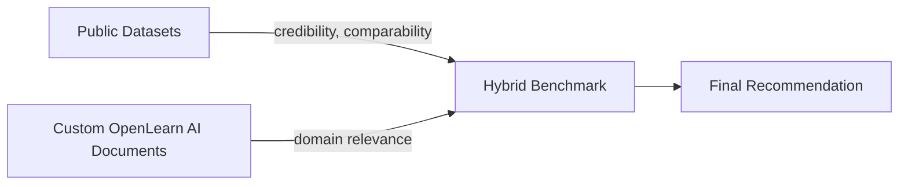
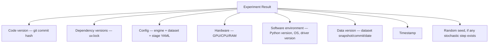
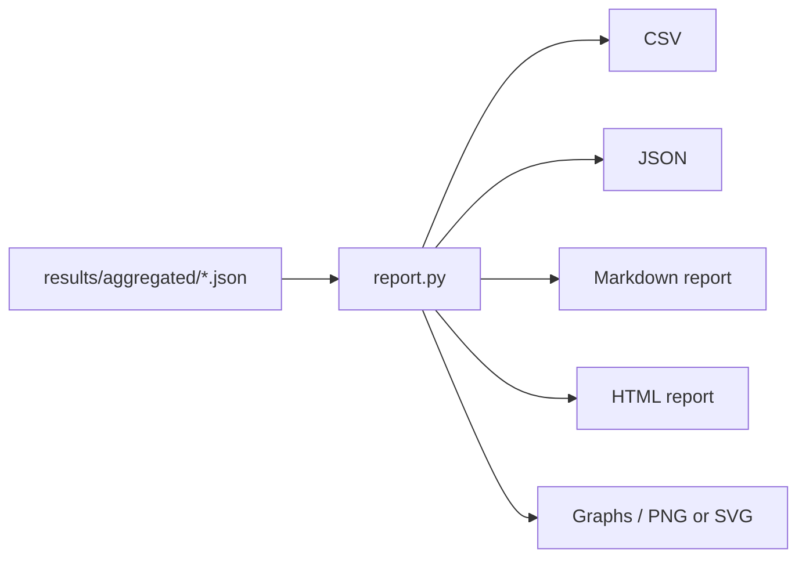
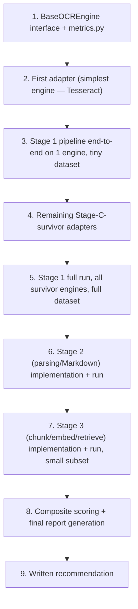

# OCR Benchmarking Handbook

### The Official OCR Evaluation Framework for OpenLearn AI

> **Status:** Living document — Phase 0 of the OpenLearn AI ingestion pipeline
> **Audience:** Junior ML engineers with no prior OCR evaluation experience
> **Maintainer:** OpenLearn AI Core Team
> **License of this document:** CC-BY-4.0 (adapt freely, keep attribution)

---

> [!NOTE]
> This handbook is written as a teaching document first and an engineering spec second. Every phase explains **why** before it explains **how**. If you only want commands, you can skim the `Commands` blocks — but you will get more value out of this project if you read the theory sections at least once.

---

## How to Use This Handbook

This is not a "run these ten commands and you're done" tutorial. It is structured as a **sequence of phases**, the way a university lab course or an onboarding plan at a serious AI company would be structured. Each phase ends with a **`# Stop Here`** section. You are expected to actually stop, do the listed work, verify it against the checklist, and only then move to the next phase.

This matters for a specific reason: OCR benchmarking is a field where it is extremely easy to produce numbers that *look* rigorous but are actually meaningless, because a step was skipped (no ground truth validation, no environment pinning, no separation of "OCR quality" from "parsing quality", etc.). The phased structure exists to prevent that.

---

## Table of Contents

1. [Project Context: Why OpenLearn AI Needs This Benchmark](#1-project-context-why-openlearn-ai-needs-this-benchmark)
2. [Phase 0 — Environment & CUDA Strategy](#2-phase-0--environment--cuda-strategy)
3. [Phase 1 — OCR Evaluation Theory](#3-phase-1--ocr-evaluation-theory)
4. [Phase 2 — Repository Setup](#4-phase-2--repository-setup)
5. [Phase 3 — OCR Engine Landscape & Staged Evaluation](#5-phase-3--ocr-engine-landscape--staged-evaluation)
6. [Phase 4 — Datasets: Public + Custom (Hybrid Benchmark)](#6-phase-4--datasets-public--custom-hybrid-benchmark)
7. [Phase 5 — Output Requirements & Metrics](#7-phase-5--output-requirements--metrics)
8. [Phase 6 — The Three-Stage Pipeline (OCR → Parsing → RAG)](#8-phase-6--the-three-stage-pipeline-ocr--parsing--rag)
9. [Phase 7 — Automation & Reproducibility](#9-phase-7--automation--reproducibility)
10. [Phase 8 — Implementation Roadmap](#10-phase-8--implementation-roadmap)
11. [Appendix A — Glossary](#appendix-a--glossary)
12. [Appendix B — References](#appendix-b--references)

---

## 1. Project Context: Why OpenLearn AI Needs This Benchmark

**OpenLearn AI** is an open-source adaptive learning platform. Its long-term job is to take raw educational material — lecture PDFs, textbooks, scientific papers, slides, exams, assignments — and turn it into structured content that downstream systems (adaptive quiz generation, retrieval-augmented generation (RAG) tutoring, spaced-repetition content, etc.) can use.

OCR is the **first component** of that ingestion pipeline. Everything downstream — chunking, embeddings, retrieval, tutoring — inherits whatever errors OCR introduces. A single misread character in a formula, a table that gets flattened into unreadable text, or a reading-order mistake that interleaves two columns, can silently corrupt every downstream stage without ever throwing an error. This is why OCR selection cannot be treated as an afterthought or a "pick whatever's popular" decision.

> [!IMPORTANT]
> The goal of this benchmark is **not** "which OCR engine has the highest character accuracy on a generic dataset." The goal is: **which OCR engine, integrated end-to-end, produces the best foundation for OpenLearn AI's specific downstream needs** — Arabic + English + mixed-language educational content, tables, formulas, and clean Markdown suitable for chunking and embedding.

That means the benchmark has to evaluate more than raw OCR accuracy. It has to evaluate:

| Dimension | Why it matters for OpenLearn AI |
|---|---|
| OCR quality (English) | Baseline correctness |
| OCR quality (Arabic) | Core requirement — many source materials are Arabic, RTL text is a known failure mode for many engines |
| Mixed Arabic-English | Extremely common in real lecture slides and exams (technical terms in English inside Arabic sentences) |
| Layout preservation | Multi-column slides, sidebars, headers/footers must not be scrambled |
| Markdown quality | Direct input to the parsing/chunking stage |
| Table extraction | Grades, schedules, comparison tables, data tables in papers |
| Formula handling | STEM content is a primary use case |
| Speed | Determines whether ingestion can scale to a real course catalog |
| Memory / VRAM usage | You are developing on a 4GB VRAM laptop GPU — this is a hard constraint, not a nice-to-have |
| Ease of installation | Determines onboarding cost for future contributors |
| Ease of maintenance | Determines whether the dependency will still work in a year |
| Ease of integration | Python API vs. CLI-only vs. server-based changes the whole architecture |
| License compatibility | OpenLearn AI is open-source; a copyleft or non-commercial license on a core dependency can be a legal blocker |
| Long-term maintainability | Is the project actively developed, or a research repo that will go stale? |

The final deliverable of this benchmark is not a leaderboard. It is a **written recommendation with evidence**, of the form: *"Use engine X as the default OCR backend for OpenLearn AI, because of A, B, C. Consider engine Y as a fallback for case Z. Reject engine W because of license/maintenance/accuracy issue."*


This handbook walks you through building the benchmark that answers the OCR-selection question rigorously, phase by phase.

---

# 2. Phase 0 — Environment & CUDA Strategy

## Goal

Establish a **reproducible, low-maintenance GPU environment** that lets you benchmark multiple OCR frameworks (PaddleOCR/PaddlePaddle, PyTorch-based engines like Surya and EasyOCR, Tesseract, etc.) on a single 4GB-VRAM laptop, without the CUDA version conflicts that are the single most common source of wasted time in ML benchmarking projects.

## Background Theory: The CUDA Stack, Layer by Layer

Most beginners think of "CUDA" as one thing. It is actually **four separate layers**, each with its own version number, and the confusion between them is responsible for the majority of "it works on my machine" GPU bugs.



**Layer 1 — NVIDIA Driver.** This is installed at the OS level (`nvidia-driver-595` in your case) and is the only layer that talks directly to the GPU hardware. The driver reports a **maximum CUDA version it is capable of supporting** — in your case, driver 595.84 supports up to CUDA 13.2. This is a ceiling, not a requirement: you can run software built against an *older* CUDA version just fine, as long as it's not newer than what the driver supports.

**Layer 2 — CUDA Toolkit (`nvcc`, headers, static libs).** This is a full development kit for *compiling* CUDA C++ code. You need it if you are writing custom CUDA kernels or building a framework from source. **You do not need it to run pip-installed PyTorch or PaddlePaddle**, because...

**Layer 3 — Framework-bundled CUDA runtime.** Modern PyTorch and PaddlePaddle wheels (the ones you `pip install`) ship with their **own private copies** of the CUDA runtime libraries and cuDNN, statically linked or bundled as separate `.so` files inside the Python package. When you `pip install torch`, you are not using your system's CUDA Toolkit at all (unless you specifically installed a CPU-only wheel and are relying on a system install, which is not the default path). This is why two different conda/venv environments on the same machine can use two completely different CUDA versions simultaneously without conflict — each framework brings its own.

**Layer 4 — cuDNN.** NVIDIA's library of optimized deep learning primitives (convolutions, RNN kernels, etc.). Like the CUDA runtime, it is bundled inside modern framework wheels.

## Why This Phase Exists

You are about to install **multiple, independent deep-learning frameworks side by side** (PaddlePaddle for PaddleOCR, PyTorch for Surya/EasyOCR/Qari). If you install a global CUDA Toolkit and let both frameworks assume they should use it, you will eventually hit a version mismatch that costs you an entire evening. The fix is architectural, not a workaround: **isolate every framework in its own environment and let each framework manage its own CUDA runtime.**

## Concepts to Learn

- [ ] Difference between "CUDA the driver API" and "CUDA the toolkit"
- [ ] Why `pip install torch` gives you a working GPU setup without `nvcc`
- [ ] What `nvidia-smi` actually reports (driver's max supported CUDA — **not** the CUDA version currently in use)
- [ ] Why per-project virtual environments matter more for ML than for typical web projects
- [ ] VRAM budgeting: why a 4GB card requires you to benchmark models one at a time, not concurrently

## Recommendation: The Most Maintainable Solution

> [!TIP]
> **Do not install the CUDA Toolkit globally.** Rely on framework-bundled CUDA runtimes, isolate every OCR engine in its own `uv`-managed virtual environment, and use `nvidia-smi` only as a health check for the driver layer.

Concretely:

1. **Keep the NVIDIA driver up to date at the OS level** — this is the one layer that must be global, because it's a kernel module. Your driver 595.84 (CUDA 13.2 capability) is already new enough to satisfy virtually every framework's minimum requirement for the foreseeable future.
2. **Do not install `nvidia-cuda-toolkit` system-wide.** You are not compiling CUDA kernels from source. If a specific framework's documentation insists it needs the system toolkit (rare, and usually only for from-source builds), install it inside a Docker image scoped to that one framework instead of on the host.
3. **One `uv` virtual environment per OCR engine.** Each engine gets its own `pyproject.toml` / `uv.lock`, pinned to a specific `torch==` or `paddlepaddle-gpu==` version that matches a CUDA build ≤ 13.2 (your driver ceiling). This means PaddleOCR's PyTorch-adjacent dependencies can never collide with Surya's PyTorch version.
4. **Use Docker for anything with awkward native dependencies** (notably PaddlePaddle, which has historically had more finicky Linux packaging than PyTorch). A `Dockerfile` per engine also gives you the reproducibility story for free — see Phase 7.
5. **Track VRAM, not just "does it run."** With 4GB of VRAM, note in every experiment log whether the engine ran on GPU at all, or silently fell back to CPU. Several OCR frameworks fail *silently* to CPU when VRAM allocation fails, which will quietly ruin your speed comparisons if you don't check for it.

### Why not one shared global environment?

| Approach | Pros | Cons |
|---|---|---|
| One global CUDA Toolkit + one shared venv | Simple at first glance | First real version conflict (e.g., Paddle wants CUDA 12.x runtime behavior, a Torch nightly wants 12.4+) forces you to rebuild everything; not reproducible for contributors |
| Per-engine `uv` venvs, framework-bundled CUDA (**recommended**) | Each engine isolated; matches how PyPI wheels are actually built; trivial to reproduce with `uv.lock` | Slightly more disk space (~2-4GB per framework) |
| Per-engine Docker containers | Maximum isolation, best reproducibility, works for future CI | Slower iteration loop; more upfront setup |

> [!NOTE]
> The recommended path is **`uv` venvs for day-to-day experimentation, Docker for the final reproducible benchmark run.** This gives you fast iteration while learning, and a bulletproof reproducibility story once the benchmark matures (see Phase 7).

## Folder Structure (Phase 0 artifacts)

```text
ocr-benchmark/
└── envs/
    ├── paddleocr/
    │   ├── pyproject.toml
    │   └── uv.lock
    ├── surya/
    │   ├── pyproject.toml
    │   └── uv.lock
    ├── easyocr/
    │   ├── pyproject.toml
    │   └── uv.lock
    ├── tesseract/          # no GPU env needed, CPU-only
    │   └── pyproject.toml
    └── qari/
        ├── pyproject.toml
        └── uv.lock
```

## Commands

Check the driver and its CUDA ceiling:

```bash
nvidia-smi
# Look at "CUDA Version: 13.2" in the top-right of the output —
# this is the MAXIMUM the driver supports, not what any given
# framework will actually use.
```

Create an isolated environment for one engine with `uv`:

```bash
cd ocr-benchmark/envs/paddleocr
uv init --no-workspace
uv add "paddlepaddle-gpu" "paddleocr"
uv run python -c "import paddle; paddle.utils.run_check()"
```

Verify PyTorch sees the GPU in a separate engine's environment:

```bash
cd ocr-benchmark/envs/surya
uv init --no-workspace
uv add torch surya-ocr
uv run python -c "import torch; print(torch.cuda.is_available(), torch.cuda.get_device_name(0))"
```

Check actual VRAM usage while a benchmark runs (in a second terminal):

```bash
watch -n 1 nvidia-smi --query-gpu=memory.used,memory.total,utilization.gpu --format=csv
```

## Best Practices

- Pin exact framework versions in each `pyproject.toml` (`torch==2.x.x`, not `torch>=2`) — see Phase 7 for why.
- Record `nvidia-smi` output as part of every experiment's metadata (Phase 7), not just once at setup time — drivers and dependencies drift.
- Treat "runs on CPU instead of GPU" as a **hard failure to flag**, not a silent slowdown — always assert `torch.cuda.is_available()` / `paddle.is_compiled_with_cuda()` at the start of each benchmark script.

## Common Mistakes

> [!WARNING]
> - Installing a system-wide CUDA Toolkit "just in case," then fighting version mismatches between it and framework-bundled runtimes for hours.
> - Assuming `nvidia-smi`'s "CUDA Version" field tells you what CUDA version PyTorch is actually using — it does not; check `torch.version.cuda` instead.
> - Running two GPU-heavy OCR benchmarks concurrently on a 4GB card and getting an out-of-memory crash that looks like a framework bug but is actually a VRAM budgeting mistake.
> - Forgetting that PaddlePaddle's GPU wheel naming (`paddlepaddle-gpu`) requires matching against a specific CUDA "flavor" in its install command — always follow PaddlePaddle's own install matrix rather than guessing.

## Verification Checklist

- [ ] `nvidia-smi` runs and reports driver 595.84 / CUDA capability 13.2
- [ ] At least one isolated `uv` environment created and its framework confirms GPU access
- [ ] `torch.version.cuda` (or Paddle's equivalent) recorded and matches expectations
- [ ] VRAM monitoring command (`watch nvidia-smi`) tested and working
- [ ] Confirmed no global CUDA Toolkit installation exists (`which nvcc` returns nothing, or you consciously accept it's only used inside Docker)

## Deliverables

- `envs/` directory with at least one working, GPU-verified engine environment
- A short `docs/environment.md` note recording driver version, CUDA ceiling, and the "framework-bundled CUDA, no global toolkit" decision (you'll expand this in Phase 7's reproducibility work)

---

# Stop Here

Before moving to Phase 1, make sure:

1. You can explain, in your own words, the difference between the NVIDIA driver's CUDA version and a framework's bundled CUDA runtime.
2. You have at least one working `uv` virtual environment where a GPU framework (PyTorch or PaddlePaddle) confirms `cuda_available = True`.
3. You have **not** installed a system-wide CUDA Toolkit.
4. You understand why VRAM (4GB) is a first-class constraint for this project, not an implementation detail.

Do not start installing OCR engines for real benchmarking yet — Phase 3 will guide that, after the theory in Phase 1 and the repo scaffold in Phase 2 are in place.

---

# 3. Phase 1 — OCR Evaluation Theory

## Goal

Build a solid mental model of how OCR is actually evaluated in research and industry, so that every metric you compute later has a clear meaning and every design decision in the benchmark (Phase 3 onward) is grounded in theory instead of guesswork.

## Background Theory

### 3.1 What "OCR" actually covers today

Classical OCR (think: 1990s scanner software) was a single task: image of text → text. Modern "OCR" systems, especially the ones on your list (PaddleOCR-VL, Surya, Qari), are really **document understanding pipelines** that bundle several sub-tasks:



- **Layout detection**: finds regions (paragraph, title, table, figure, formula, header/footer) on the page.
- **Reading order resolution**: decides the sequence those regions should be read in — critical for multi-column slides.
- **Text detection**: finds bounding boxes of text lines/words within a region.
- **Text recognition**: converts each detected box into characters (this is what most people mean by "OCR accuracy").
- **Table / formula recognition**: specialized sub-models that convert visually-structured regions into structured markup (HTML tables, LaTeX).

Understanding this decomposition matters because when an engine "does badly," you need to know **which sub-task failed** — a wrong reading order looks completely different from a wrong character, and they require different fixes.

### 3.2 Core Text-Recognition Metrics

**Character Error Rate (CER)** — edit distance (insertions + deletions + substitutions) between predicted and ground-truth text, divided by the number of characters in ground truth:

```
CER = (S + D + I) / N
```
where `S` = substitutions, `D` = deletions, `I` = insertions, `N` = total ground-truth characters.

**Word Error Rate (WER)** — same formula, but computed over whitespace-tokenized words instead of characters. WER is generally less meaningful for Arabic than for English, because Arabic word segmentation and diacritics interact with tokenization in ways that inflate WER without reflecting real quality differences.

> [!NOTE]
> For Arabic text specifically, always report CER computed **after normalizing optional diacritics (tashkeel)** as a separate metric from CER **with diacritics preserved**, and state clearly which one you're reporting. Conflating the two is one of the most common errors in Arabic OCR papers.

**Normalized Edit Distance** — CER computed after applying a fixed normalization function (lowercasing for Latin scripts, unifying Arabic letter variants like أ/إ/آ → ا, stripping punctuation) so that trivial formatting differences don't get counted as errors. You should compute **both raw and normalized CER** and report the gap — a large gap tells you the engine's *content* is fine but its *formatting conventions* differ from your ground truth.

### 3.3 Layout & Structure Metrics

- **IoU (Intersection over Union)** for bounding boxes — standard object-detection metric, used to judge whether a detected text/table/figure region overlaps sufficiently with ground truth.
- **Reading order accuracy** — typically measured via a rank-correlation metric (e.g., Kendall's Tau) between predicted and ground-truth region ordering.
- **TEDS (Tree-Edit-Distance-based Similarity)** — the standard metric for table structure recognition; compares predicted vs. ground-truth tables as HTML trees, accounting for both structure (rows/cols/merges) and cell content.

### 3.4 Why Downstream-Aware Metrics Matter More Than Raw CER

A crucial and often-missed point: **a lower CER does not always mean a better OCR engine for a RAG pipeline.** An engine that has slightly higher CER but produces clean paragraph boundaries, correct reading order, and well-formed Markdown headings will chunk and embed far better than an engine with lower CER but scrambled layout. This is why Phase 6 introduces **downstream-aware evaluation** (Stage 2 and Stage 3 of the pipeline) rather than stopping at Stage 1 raw-text metrics.

## Why This Phase Exists

If you jump straight to running engines and looking at output "by eye," you will form opinions that feel confident but aren't reproducible or defensible in a graduation project write-up. Learning the metrics vocabulary first means every later phase can say precisely *what* it is measuring and *why* that measurement matters for OpenLearn AI.

## Concepts to Learn

- [ ] CER vs. WER, and why WER is weaker for Arabic
- [ ] Raw vs. normalized edit distance, and Arabic-specific normalization rules
- [ ] IoU for detection quality
- [ ] TEDS for table structure
- [ ] Reading-order metrics
- [ ] Why "eyeballing output" is a valid *first pass* (Phase 3's elimination stage) but not a valid *final justification*

## Folder Structure

```text
ocr-benchmark/
└── docs/
    └── theory/
        ├── metrics.md          # your own notes on CER/WER/TEDS/IoU, written in your own words
        └── glossary.md         # growing glossary, feeds Appendix A of this handbook
```

## Commands

Install a couple of lightweight metric libraries you'll use starting Phase 5 (in a shared "tooling" env, separate from the per-engine GPU envs from Phase 0):

```bash
cd ocr-benchmark/envs/tooling
uv init --no-workspace
uv add jiwer python-Levenshtein rapidfuzz
```

`jiwer` computes CER/WER directly; `rapidfuzz`/`python-Levenshtein` give you fast edit-distance primitives for building normalized/custom metrics.

## Best Practices

- Write your own one-paragraph explanation of each metric in `docs/theory/metrics.md` before using any library — if you can't explain it, you can't debug it when a number looks wrong.
- Always report **both** raw and normalized CER, never just one.
- Keep a running glossary (`docs/theory/glossary.md`) — you will reuse these terms constantly in your graduation project write-up.

## Common Mistakes

> [!WARNING]
> - Reporting a single "accuracy" number without specifying CER vs. WER vs. something else.
> - Comparing CER across engines that were evaluated against ground truth annotated by different rules (e.g., one dataset keeps diacritics, another strips them) — this invalidates cross-dataset comparisons.
> - Treating table/formula output as "text" and running plain CER on it, which produces meaningless numbers because structural markup counts as "errors."

## Verification Checklist

- [ ] You can explain CER, WER, IoU, and TEDS from memory, without looking them up
- [ ] `docs/theory/metrics.md` written in your own words
- [ ] `jiwer` installed and tested on a trivial example (predicted vs. reference string)
- [ ] You understand why Arabic needs diacritic-aware normalization decisions

## Deliverables

- `docs/theory/metrics.md`
- `docs/theory/glossary.md` (seed version)
- A tiny working script `scripts/sanity/test_cer.py` that computes CER on two hardcoded strings using `jiwer`, to confirm the tooling environment works

---

# Stop Here

Before Phase 2:

1. You should be able to define CER, WER, IoU, and TEDS out loud, without notes.
2. You understand *why* raw text-accuracy metrics are insufficient on their own for a RAG-feeding pipeline like OpenLearn AI's.
3. Your tooling environment (`envs/tooling`) is working and `jiwer` produces a correct CER on a toy example.

Do not design the repository yet — Phase 2 does that next, informed by the metrics vocabulary you just learned.

---

# 4. Phase 2 — Repository Setup

## Goal

Create a professional, extensible repository layout that (a) makes it trivial to add a new OCR engine later, (b) cleanly separates raw data, code, results, and reports, and (c) is ready to eventually be absorbed into the main OpenLearn AI monorepo without a painful restructuring.

## Background Theory: Why Layout Discipline Matters in Benchmarking Projects

Benchmarking codebases rot faster than almost any other kind of software, for a structural reason: every new engine you add tends to need "just one small script," and without discipline you end up with a folder full of `test2_final_REAL.py`-style scripts that nobody — including future you — can trust. The fix is to enforce a strict separation between:

- **Adapters** (engine-specific code — the *only* place engine-specific quirks are allowed to live)
- **Core** (shared evaluation logic — metrics, dataset loading, report generation — that must never depend on any specific engine)
- **Data** (raw + processed, never mutated in place)
- **Results** (generated, never hand-edited, always reproducible from data + code)
- **Reports** (human-readable summaries generated from results)

This "adapter pattern" is what lets you add PaddleOCR-VL, Surya, Qari, etc., as independent, drop-in modules without touching the evaluation core.



## Why This Phase Exists

Doing repository design *after* the theory phases (0 and 1) means the folder names and abstractions you choose actually map to real concepts you now understand (adapters, metrics, staged evaluation) instead of being guessed upfront.

## Concepts to Learn

- [ ] The adapter/plugin pattern for pluggable backends
- [ ] Why results and reports should be git-ignored (generated) while configs should be version-controlled
- [ ] Monorepo-readiness: designing folder boundaries so this repo can become `packages/ocr-benchmark/` inside OpenLearn AI later with minimal path surgery
- [ ] Separating "raw" vs. "processed" data (never overwrite raw inputs)

## Folder Structure

```text
ocr-benchmark/                         # standalone repo today, packages/ocr-benchmark/ in OpenLearn AI later
├── README.md
├── OCR_BENCHMARKING_HANDBOOK.md       # this document
├── pyproject.toml                     # top-level tooling (linters, formatters) only
├── uv.lock
├── .gitignore
├── .env.example
│
├── envs/                              # Phase 0 — one isolated env per engine
│   ├── paddleocr/
│   ├── surya/
│   ├── easyocr/
│   ├── tesseract/
│   └── qari/
│
├── src/
│   └── ocrbench/
│       ├── __init__.py
│       ├── core/
│       │   ├── base_engine.py         # BaseOCREngine abstract interface
│       │   ├── metrics.py             # CER, WER, IoU, TEDS wrappers
│       │   ├── dataset.py             # dataset loading + ground-truth alignment
│       │   ├── pipeline.py            # Stage 1/2/3 orchestration (Phase 6)
│       │   └── report.py              # CSV/JSON/Markdown/HTML generation (Phase 7)
│       ├── adapters/
│       │   ├── paddleocr_adapter.py
│       │   ├── paddleocr_vl_adapter.py
│       │   ├── surya_adapter.py
│       │   ├── tesseract_adapter.py
│       │   ├── easyocr_adapter.py
│       │   ├── ocrmypdf_adapter.py
│       │   └── qari_adapter.py
│       └── utils/
│           ├── hardware_info.py       # captures GPU/CPU/RAM (Phase 7)
│           └── text_normalize.py      # Arabic/Latin normalization rules (Phase 1)
│
├── data/
│   ├── raw/                           # untouched originals — never edited
│   │   ├── public/                    # KITAB-Bench, FUNSD, SROIE, DocBank, Misraj-DocOCR subsets
│   │   └── custom/                    # your own OpenLearn AI educational PDFs
│   ├── processed/                     # rendered page images, aligned ground truth
│   └── ground_truth/                  # transcriptions/annotations, versioned carefully
│
├── configs/
│   ├── engines/                       # one YAML per engine: model variant, thresholds, device
│   ├── datasets/                      # one YAML per dataset: paths, splits, language tags
│   └── experiments/                   # one YAML per experiment run, composes engine+dataset+stage
│
├── results/                           # GENERATED — gitignored except .gitkeep
│   ├── raw/                           # per-document, per-engine raw outputs
│   └── aggregated/                    # CSV/JSON summary tables
│
├── reports/                           # GENERATED — Markdown/HTML comparison reports
│
├── scripts/
│   ├── run_experiment.py              # CLI entrypoint (Phase 8)
│   ├── generate_report.py
│   └── sanity/
│       └── test_cer.py
│
├── docker/
│   ├── paddleocr.Dockerfile
│   ├── surya.Dockerfile
│   └── ...
│
├── tests/
│   ├── test_metrics.py
│   ├── test_adapters.py
│   └── test_dataset_loading.py
│
└── docs/
    ├── theory/
    ├── environment.md
    ├── datasets.md
    └── decisions/                     # ADRs — Architecture Decision Records
        └── 0001-cuda-strategy.md
```

## Commands

Initialize the repo:

```bash
mkdir ocr-benchmark && cd ocr-benchmark
git init
uv init --no-workspace
mkdir -p src/ocrbench/{core,adapters,utils} data/{raw/{public,custom},processed,ground_truth} \
         configs/{engines,datasets,experiments} results/{raw,aggregated} reports scripts/sanity \
         docker tests docs/{theory,decisions} envs
touch results/.gitkeep reports/.gitkeep
```

Set up `.gitignore` essentials:

```bash
cat >> .gitignore << 'EOF'
results/*
!results/.gitkeep
reports/*
!reports/.gitkeep
data/processed/*
.venv/
__pycache__/
*.pyc
.env
EOF
```

## Best Practices

- **`data/raw/` is read-only by convention** — never write generated files there. Enforce this culturally (and optionally with file permissions).
- **One YAML config per experiment**, not command-line flags scattered across scripts — this is what makes runs reproducible (Phase 7).
- Adapters implement a single shared interface (`BaseOCREngine.run(image) -> OCRResult`) so the core evaluation code never has an `if engine == "paddleocr"` branch anywhere.
- Use **Architecture Decision Records** (`docs/decisions/000X-*.md`) for irreversible-ish choices (like the CUDA strategy from Phase 0) — a short "context / decision / consequences" doc future-you and future contributors will thank you for.

## Common Mistakes

> [!WARNING]
> - Putting engine-specific pre/post-processing logic inside the shared `core/` module "just this once" — this is how adapter boundaries erode.
> - Committing `results/` and `reports/` to git — they should be regenerated from `data/` + `configs/` + code, not hand-maintained.
> - Mixing raw and processed data in the same folder, making it impossible to tell what's an original source file.

## Verification Checklist

- [ ] Repository initialized with git and `uv`
- [ ] Full folder tree created (even if most files are still empty stubs)
- [ ] `.gitignore` correctly excludes `results/`, `reports/`, `data/processed/`, and virtual environments
- [ ] `docs/decisions/0001-cuda-strategy.md` written, capturing the Phase 0 decision
- [ ] You can explain the adapter pattern and why `core/` must never import anything engine-specific

## Deliverables

- Fully scaffolded repository matching the tree above
- `docs/decisions/0001-cuda-strategy.md`
- `README.md` with a one-paragraph project description and a link to this handbook

---

# Stop Here

Before Phase 3:

1. The full repository tree exists on disk, even with placeholder/empty files.
2. `.gitignore` is correct — generated folders are excluded.
3. You can explain, without looking it up, why `core/` code must never contain engine-specific branches.
4. Your first ADR (`0001-cuda-strategy.md`) is written.

Do not start writing adapters yet — Phase 3 first teaches the staged evaluation process that determines *which* engines are even worth writing full adapters for.

---

# 5. Phase 3 — OCR Engine Landscape & Staged Evaluation

## Goal

Understand each candidate engine well enough to run a fast, cheap **elimination pass**, so that expensive deep benchmarking (Phase 5+) is only spent on engines that could plausibly become OpenLearn AI's default.

## Background Theory: Why Staged Evaluation, Not "Benchmark Everything Equally"

If you run the full metric suite (CER, WER, TEDS, reading-order accuracy, speed, VRAM profiling across every dataset) on every engine from day one, you will burn most of your project time on engines that were obviously wrong for this use case (e.g., an English-only OCR engine, for a project with a hard Arabic requirement). Serious benchmarking practice — in both industry and research — uses a **funnel**:



Each stage costs roughly an order of magnitude more time than the previous one, so the funnel shape is deliberate: eliminate cheaply, benchmark deeply only what survives.

## Candidate Engine Overview

| Engine | Type | Arabic Support | Table/Formula | Typical Use Case | License |
|---|---|---|---|---|---|
| **PaddleOCR** | Detection+recognition pipeline (PaddlePaddle) | Yes (multilingual models, incl. Arabic) | Table: yes (PP-Structure); Formula: limited | General-purpose, mature, widely deployed | Apache-2.0 |
| **PaddleOCR-VL** | Vision-language document parsing model (newer PaddleOCR generation) | Depends on release — verify current multilingual coverage | Stronger table/formula handling via VLM approach | Layout-heavy documents, direct Markdown output | Apache-2.0 (verify per release) |
| **Surya OCR** | PyTorch-based, layout+OCR+reading-order in one toolkit | Broad multilingual claims — verify Arabic quality directly | Table detection improving across releases | Documents needing strong reading-order/layout awareness | GPL-family / check current release — **verify before production use** |
| **Tesseract** | Classical, mature, CPU-first engine (LSTM-based since v4) | Yes, via `ara` language pack — quality varies with training data and preprocessing | No native table/formula understanding — text only | Baseline comparator; extremely well understood, no GPU needed | Apache-2.0 |
| **EasyOCR** | PyTorch-based, detection+recognition | Supports Arabic language pack | No table/formula support | Quick prototyping, simple deployment | Apache-2.0 |
| **OCRmyPDF** | Not an OCR engine itself — a **pipeline wrapper around Tesseract** that adds a searchable text layer to PDFs | Inherits Tesseract's Arabic support | No | Producing searchable PDFs, not primarily a benchmarking target for raw accuracy | MPL-2.0 |
| **Qari OCR** | Arabic-specialized OCR model (verify current maintenance status before relying on it) | Arabic-first / Arabic-specialized | Varies by release | Potential strong candidate specifically *because* of Arabic focus — worth the smoke test even if less mainstream | Verify per release |

> [!WARNING]
> License strings and exact capabilities for fast-moving OCR projects (especially newer VLM-style ones like PaddleOCR-VL and toolkits like Surya) change between releases. **Do not copy the license/capability claims in this table into your final report without re-verifying them against the engine's current repository at the time you run your benchmark.** Treat this table as a starting map, not a citable source.

## Stage A — Feasibility Screen (cheap, ~1 day)

For each engine, answer these without running any code beyond `pip install`:

- [ ] Does it install cleanly in an isolated `uv` environment on your OS/Python version?
- [ ] Does its license permit use inside an open-source project the way OpenLearn AI intends to be distributed?
- [ ] Does it claim Arabic support at all? (If not, and it can't be extended, eliminate immediately — Arabic is a hard requirement.)
- [ ] Is the project actively maintained (commits/releases in the last ~6 months) or effectively abandoned?
- [ ] Does it run on your hardware profile at all (CPU fallback acceptable, but does it *run*)?

Any engine that fails the license check or has zero Arabic support and no reasonable path to add it should be **eliminated here**, with the reason recorded — do not silently drop it, document why.

## Stage B — Smoke Test (cheap-ish, ~2-3 days)

For engines that survive Stage A, run each on a small, fixed set of **5-10 representative sample documents** (one Arabic, one English, one mixed, one with a table, one scanned/low-quality) and *look at the output yourself*. You are not computing metrics yet — you are answering:

- [ ] Does it crash on any sample?
- [ ] Is the output roughly readable/correct at a glance?
- [ ] Does Arabic render in the correct reading direction and without obviously garbled characters?
- [ ] Does it preserve a two-column slide's reading order at all, even roughly?
- [ ] Is installation/first-run painless enough that a future contributor could set it up in under 30 minutes?

Engines that crash outright, produce obviously garbled Arabic, or require disproportionate setup effort get eliminated here — again, document the reason.

## Stage C — Deep Benchmark (expensive, main body of Phases 4-8)

Only engines that survive Stage B proceed to the full metric suite (CER/WER/TEDS/reading-order, speed, VRAM, across the full hybrid dataset from Phase 4) described in the rest of this handbook.

## Why This Phase Exists

Without a funnel, it is tempting to spend equal engineering effort writing a full adapter, config, and test suite for every engine on the list — including ones that were obviously wrong within the first hour. The staged approach keeps your graduation-project timeline realistic and keeps the final deep-benchmark section focused on a small number of genuinely competitive candidates (typically 2-4 survive to Stage C).

## Concepts to Learn

- [ ] Funnel-style evaluation design (cheap filters before expensive tests)
- [ ] How to read an open-source project's maintenance signals (release cadence, open issue triage, license file)
- [ ] Why "eliminate with a documented reason" beats "silently ignore" for a graduation project's credibility

## Folder Structure

```text
ocr-benchmark/
└── docs/
    └── screening/
        ├── stage_a_feasibility.md     # one row per engine, pass/fail + reason
        ├── stage_b_smoke_test.md      # observations per engine per sample doc
        └── survivors.md               # final list of engines proceeding to Stage C
```

## Commands

Quick feasibility install check (repeat per engine, inside its own `uv` env from Phase 0):

```bash
cd envs/qari
uv init --no-workspace
uv add <qari-ocr-package>              # exact package name — verify on PyPI at benchmarking time
uv run python -c "import <qari_package>; print('import OK')"
```

Run a smoke test against a handful of sample PDFs (pseudocode — real adapter code comes in Phase 8):

```bash
uv run python scripts/sanity/smoke_test.py \
  --engine qari \
  --input data/raw/custom/smoke_samples/ \
  --output results/raw/smoke/qari/
```

## Best Practices

- Keep the smoke-test sample set **identical across all engines** — same 5-10 documents — so observations are comparable.
- Write down Stage A/B verdicts **immediately**, in `docs/screening/`, even though they're informal — memory of "engine X seemed kind of bad" fades and stops being defensible in your final report.
- Re-check license text yourself directly in each project's repository; don't trust secondhand summaries (including the table above).

## Common Mistakes

> [!WARNING]
> - Eliminating an engine based on a single bad sample document without checking whether that document itself was low quality (e.g., a genuinely unreadable scan).
> - Letting "engine looked cool in its README" bias the smoke test — evaluate against your actual sample documents, not the project's own marketing examples.
> - Skipping the license check because "it's just a benchmark, not production" — if the goal is to recommend a default for OpenLearn AI, license compatibility has to be checked now, not deferred.

## Verification Checklist

- [ ] `docs/screening/stage_a_feasibility.md` filled in for all 7 candidate engines
- [ ] `docs/screening/stage_b_smoke_test.md` filled in for every Stage-A survivor
- [ ] `docs/screening/survivors.md` lists the final 2-4 engines proceeding to deep benchmarking, each with a one-line justification
- [ ] Eliminated engines have documented reasons, not silent omission

## Deliverables

- Completed screening docs for all engines
- A short list (2-4 engines) of Stage-C survivors that Phases 5-8 will deep-benchmark

---

# Stop Here

Before Phase 4:

1. All 7 engines have a Stage A verdict, documented with a reason.
2. Stage-A survivors have a Stage B smoke-test verdict, documented with a reason.
3. You have a final survivor list of 2-4 engines for deep benchmarking.
4. You can explain why funnel-style elimination is more defensible in a graduation project than benchmarking everything equally.

Do not build the full adapter classes for every engine — only build them for Stage-C survivors, starting in Phase 8.

---

# 6. Phase 4 — Datasets: Public + Custom (Hybrid Benchmark)

## Goal

Design a dataset strategy that combines established public OCR benchmarks (for credibility and comparability with published research) with your own OpenLearn AI educational documents (for relevance to the actual deployment context), and understand each public dataset's strengths, weaknesses, and licensing well enough to defend the choice in your graduation project.

## Background Theory: Why Public Datasets Alone Are Not Enough

Public OCR benchmark datasets are built for **general research comparability** — they let you say "our CER matches published numbers," which is valuable. But none of them is built specifically around *university lecture slides, Arabic-English mixed technical content, or exam papers* — OpenLearn AI's actual domain. A benchmark built purely on public datasets can be rigorous and still answer the wrong question. A benchmark built purely on your own documents is relevant but not comparable to anything else and vulnerable to accusations of cherry-picking. The fix is a **hybrid design**: public datasets establish a credible floor, your own documents establish domain relevance.



## Public Dataset Comparison

| Dataset | Languages | Document Types | Strengths | Weaknesses | License | Use in this benchmark |
|---|---|---|---|---|---|---|
| **KITAB-Bench** | Arabic (primary) | Diverse Arabic document types, built specifically to evaluate modern OCR/VLM pipelines on Arabic | Purpose-built for Arabic OCR/document-understanding evaluation; covers layout, tables, and text jointly — closer to your real need than older Arabic OCR sets | Newer/less universally cited than legacy English benchmarks; verify current version and exact task coverage before relying on published leaderboard numbers | Check current repo — verify before use | **Primary Arabic benchmark** — most directly relevant public set for your Arabic requirement |
| **Misraj-DocOCR** | Arabic | Document OCR, real-world Arabic documents | Arabic-specific, real-world document distribution rather than synthetic | Smaller/newer, less third-party validation than larger legacy benchmarks — verify scope and license directly | Check current repo — verify before use | Secondary Arabic validation set, cross-check against KITAB-Bench results |
| **FUNSD** | English | Scanned noisy forms | Well-established, good for form/layout understanding tasks, widely cited | English-only; forms are not representative of lecture slides/textbooks; small (~199 documents) | Public research license — verify terms for your use | Layout/key-value extraction sanity check only, not a core signal |
| **SROIE** | English | Scanned receipts | Well-established for text detection/recognition + structured info extraction on small documents | Extremely narrow domain (receipts) — almost no relevance to lecture/textbook content | Public research license — verify terms for your use | Minor — receipts are not representative of OpenLearn AI content; low priority |
| **DocBank** | English | Large-scale scientific paper layout annotations, weakly-labeled from LaTeX source | Large scale, strong for layout/token-classification pretraining and evaluation on academic-paper-style documents (relevant to your "scientific papers" document type) | English-only; weak (auto-generated) labels rather than human-verified, some label noise | Public — verify current terms | Useful proxy for **scientific paper layout**, one of your explicit target document types |

> [!NOTE]
> Every dataset row above needs to be **re-verified against the dataset's current hosting page** before you commit to using it — download links, exact license text, and version numbers for research datasets change, and some are gated behind a request form. Treat this table as a starting research map, not a final citation.

## Why Each Should (or Shouldn't) Be Used

- **KITAB-Bench** — use as your **primary Arabic quantitative benchmark**, because it's the only dataset in this list purpose-built to evaluate the exact kind of Arabic document understanding OpenLearn AI needs.
- **Misraj-DocOCR** — use as a **secondary cross-check**; if an engine's ranking is consistent across both KITAB-Bench and Misraj-DocOCR, that's stronger evidence than either alone.
- **FUNSD** — use narrowly, if at all, mainly to sanity-check layout/key-value extraction behavior; do not treat it as representative of your domain.
- **SROIE** — lowest priority; include only if you want a quick, well-understood detection/recognition sanity check, not as a decision-driving dataset.
- **DocBank** — genuinely useful as a proxy for the **scientific paper** document type, since its documents are actual academic-paper layouts.

None of these datasets covers **mixed Arabic-English content**, **university lecture slides**, or **exam/assignment layouts** — which is exactly the gap your **custom OpenLearn AI dataset** must fill.

## Designing the Custom OpenLearn AI Dataset

Build a small, carefully curated, ground-truth-annotated set covering the document types explicitly in scope:

| Category | Target count (starting point) | Notes |
|---|---|---|
| University lecture PDFs (born-digital) | 5-10 | Include at least one multi-column layout |
| University lecture PDFs (scanned) | 5-10 | Include at least one low-quality scan |
| Textbook excerpts | 3-5 | Include at least one with footnotes |
| Scientific / research papers | 5 | Two-column academic layout, references section |
| Slides (born-digital export) | 5-10 | Test reading order across boxes/columns |
| Exams / assignments | 5 | Often has numbered questions + diagrams |
| Pure Arabic documents | 5-10 | Spread across the categories above |
| Pure English documents | 5-10 | Spread across the categories above |
| Mixed Arabic-English documents | 5-10 | **Highest priority** — this is OpenLearn AI's core differentiator |
| Documents with tables | 5 | Grades tables, comparison tables, data tables |
| Documents with formulas | 5 | STEM lecture/exam content |
| Documents with figures/diagrams | 5 | Verify OCR doesn't hallucinate text into figure regions |
| Optional: handwritten notes | 2-3 | Stretch goal, not required for MVP |

> [!TIP]
> Start small and correct rather than large and unreliable. 40-60 well-annotated custom documents, each with a careful, hand-verified ground-truth transcription, is far more valuable than 500 documents with sloppy or auto-generated ground truth. Ground-truth quality is the ceiling on how trustworthy *any* metric you compute later can be.

## Ground Truth Annotation Process

1. Select the document.
2. Render each page to image (for scanned) or extract as-is (for born-digital), storing in `data/processed/`.
3. Produce a hand-verified plain-text and Markdown transcription (structure matters — headings, lists, tables as Markdown tables).
4. For table-containing pages, additionally store an HTML ground-truth table (required for TEDS scoring, Phase 1).
5. Store metadata: language tag(s), document type, scan quality flag, presence of tables/formulas/figures.
6. Version the ground truth deliberately — treat corrections to ground truth as significant changes requiring a changelog entry, since they retroactively affect all prior benchmark results.

## Why This Phase Exists

The dataset is the single biggest determinant of whether your final recommendation is trustworthy. A hybrid design lets you say, in your graduation project defense, both *"our results are consistent with the published KITAB-Bench evaluation methodology"* (credibility) **and** *"our results reflect OpenLearn AI's actual document distribution"* (relevance) — which is a much stronger position than either alone.

## Concepts to Learn

- [ ] Why domain-specific evaluation data usually matters more than generic benchmark scale
- [ ] Ground-truth annotation discipline, and why sloppy ground truth silently caps benchmark validity
- [ ] Dataset licensing basics — research-only vs. permissive vs. requires-attribution
- [ ] Why cross-dataset consistency (an engine ranking well on both KITAB-Bench and your custom set) is stronger evidence than a single dataset's result

## Folder Structure

```text
ocr-benchmark/
└── data/
    ├── raw/
    │   ├── public/
    │   │   ├── kitab_bench/
    │   │   ├── misraj_dococr/
    │   │   ├── funsd/
    │   │   ├── sroie/
    │   │   └── docbank/
    │   └── custom/
    │       ├── lectures_digital/
    │       ├── lectures_scanned/
    │       ├── textbooks/
    │       ├── papers/
    │       ├── slides/
    │       ├── exams/
    │       └── mixed_language/
    ├── ground_truth/
    │   ├── public/          # aligned to the same structure as raw/public
    │   └── custom/          # your hand-verified transcriptions
    └── processed/
        ├── page_images/
        └── metadata.csv     # one row per document: lang, type, quality, has_table, has_formula, has_figure
```

## Commands

Fetch and inspect a public dataset (example pattern — adjust to each dataset's actual distribution method):

```bash
cd data/raw/public
# follow each dataset's official download instructions — many require
# a request form or direct download rather than a simple git clone
mkdir kitab_bench && cd kitab_bench
# place downloaded files here, then record source URL + version + date in metadata
```

Build the custom dataset metadata index:

```bash
uv run python scripts/build_metadata_index.py \
  --input data/raw/custom/ \
  --output data/processed/metadata.csv
```

## Best Practices

- Record the **exact source URL, version/commit, and download date** for every public dataset subset you use — this goes directly into your reproducibility record (Phase 7).
- Keep custom ground truth in a human-readable format (Markdown + HTML-for-tables), not a binary/proprietary annotation format, so it's easy to review in pull requests.
- Deliberately include "hard" documents (low-quality scans, dense mixed-language pages) — a benchmark that only contains easy documents will fail to differentiate engines.

## Common Mistakes

> [!WARNING]
> - Using a public dataset's *training* split for evaluation by mistake — always confirm you're using a held-out/test split.
> - Skipping license verification because a dataset is "clearly research-oriented" — verify anyway, especially before any of this data or derived artifacts ships inside OpenLearn AI itself.
> - Building a custom dataset that's accidentally skewed toward easy, clean, born-digital documents, which will make every engine look artificially good and fail to reveal real differences.

## Verification Checklist

- [ ] Public dataset comparison table completed and independently re-verified against current sources
- [ ] At least KITAB-Bench downloaded/prepared, with source + version recorded
- [ ] Custom dataset plan filled in with real counts per category
- [ ] Ground-truth annotation process documented and at least a handful of documents fully annotated as a pilot
- [ ] `data/processed/metadata.csv` exists and covers both public and custom documents

## Deliverables

- `docs/datasets.md` — the completed comparison table plus your hybrid-dataset justification
- Initial custom dataset (pilot batch, doesn't need to be complete) with verified ground truth
- `data/processed/metadata.csv`

---

# Stop Here

Before Phase 5:

1. You can explain, from memory, one strength and one weakness of each public dataset in the comparison table.
2. You have a written justification for the hybrid (public + custom) design in `docs/datasets.md`.
3. At least a pilot batch of your custom dataset has hand-verified ground truth.
4. You understand why ground-truth quality is a ceiling on benchmark trustworthiness, not just a nice-to-have.

Do not run the deep benchmark yet — Phase 5 first defines exactly which outputs and metrics you'll be scoring.

---

# 7. Phase 5 — Output Requirements & Metrics

## Goal

Define exactly which output types each engine must be evaluated on, and connect each output type to the metric(s) from Phase 1 that score it — so that Phase 8's implementation has an unambiguous spec to follow.

## Background Theory: Output Types and What They're Good For

OCR/document-parsing engines can emit several different representations of the same page. Each serves a different downstream purpose, and a good benchmark scores each separately rather than collapsing everything into one "accuracy" number.

| Output type | What it is | Downstream use in OpenLearn AI | Relevant metric(s) |
|---|---|---|---|
| **Plain text** | Flat extracted text, no structure | Least useful alone — lacks structure for chunking | CER, WER |
| **Markdown** | Structured text with headings, lists, tables | **Primary format for the ingestion pipeline** — feeds directly into chunking | CER (on content) + structural diff (headings/lists preserved correctly) |
| **Reading order** | Sequence in which regions should be read | Determines whether Markdown output makes logical sense at all | Rank-correlation (e.g., Kendall's Tau) vs. ground-truth order |
| **Bounding boxes** | Pixel coordinates of detected regions | Useful for debugging, highlighting source regions in a future "show me where this came from" UI feature | IoU vs. ground truth |
| **Confidence scores** | Per-token/per-region model confidence | Useful for **flagging low-confidence regions for human review** in an ingestion QA step | Correlation between confidence and actual error rate (calibration) |
| **Tables** | Structured table representation (HTML/Markdown table) | Grades, schedules, comparison data — must round-trip into a queryable structure | TEDS |
| **Layout information** | Region types (title/paragraph/table/figure/footer) | Determines chunk boundaries — a paragraph shouldn't be split mid-sentence because layout was misread | Region-type classification accuracy |
| **Images/figures** | Extracted figure/diagram crops | Needed so figures aren't lost or, worse, OCR'd as garbled text | Detection recall (are figures found and *not* text-recognized inside) |

## Which Outputs Matter Most for Downstream RAG

> [!IMPORTANT]
> For a RAG pipeline specifically, **Markdown quality and reading order matter more than raw character accuracy** once CER is below a "good enough" threshold. A chunk boundary that splits a sentence in half, or a table that gets flattened into an unstructured blob of numbers, will hurt retrieval and generation quality far more than a handful of individual character substitutions that spell-correction or the LLM reading the chunk can shrug off.

Ranked by downstream importance for OpenLearn AI's RAG use case:

1. **Markdown structure quality** (headings/lists/paragraphs correctly demarcated) — chunking depends on this directly.
2. **Reading order** — feeds directly into #1; wrong order corrupts Markdown even if every character is correct.
3. **Table structure (TEDS)** — tables that lose structure become useless or actively misleading to a retrieval system.
4. **Text accuracy (CER)** — still matters, but has diminishing returns past a "good enough" point for retrieval/generation robustness.
5. **Bounding boxes / confidence scores** — valuable for a future human-in-the-loop QA feature, lower priority for the *initial* engine-selection decision.
6. **Figure handling** — mainly a "does it avoid actively corrupting the page with hallucinated text over images" check.

This ranking is what justifies the **Stage 2 and Stage 3 pipeline evaluation** in Phase 6 — evaluating Markdown/RAG-readiness, not just raw OCR text.

## Why This Phase Exists

Without an explicit output/metric mapping, it's easy to accidentally reduce the whole benchmark to "which engine has the lowest CER," which — per the theory above — is not actually the question that matters most for OpenLearn AI. This phase turns the ranked-importance argument into a concrete spec that Phase 8's scoring code implements.

## Concepts to Learn

- [ ] The distinction between output *types* and evaluation *metrics* (one output type can have multiple relevant metrics)
- [ ] Why downstream task performance should influence which metrics get weighted most heavily
- [ ] Confidence calibration — what it means for a confidence score to be "useful" vs. just noise

## Folder Structure

```text
ocr-benchmark/
└── configs/
    └── scoring/
        └── output_weights.yaml   # numeric weight per output-type/metric, used to compute a final composite score in Phase 8
```

## Commands

No new tooling install needed here — this phase is primarily a specification/config phase. Create the weighting config:

```bash
cat > configs/scoring/output_weights.yaml << 'EOF'
# Composite scoring weights — tune deliberately, document any change in an ADR
markdown_structure: 0.30
reading_order: 0.20
table_teds: 0.20
text_cer: 0.20
figure_handling: 0.05
confidence_calibration: 0.05
EOF
```

## Best Practices

- Treat the weighting file as a first-class, version-controlled decision — changing weights changes the final recommendation, so changes belong in a pull request with a stated reason, not a silent edit.
- Score each output type **independently** first (Phase 8), and only combine into a composite score at the very end — this preserves the ability to say "Engine A wins on tables but loses on speed," which is far more useful to a reader than a single number.
- Always report the composite score **alongside** the individual component scores, never instead of them.

## Common Mistakes

> [!WARNING]
> - Silently choosing weights that happen to favor whichever engine you personally expected to win — pick weights based on the downstream-importance argument in this section, before you've seen final results, and don't revisit them afterward without a documented reason.
> - Scoring Markdown output with plain CER against a plain-text ground truth, which penalizes correct Markdown syntax (`#`, `**`, `|`) as if it were an "error."
> - Ignoring confidence scores entirely just because they're optional — they're valuable for the future human-review feature even if they don't affect engine ranking directly.

## Verification Checklist

- [ ] Output-type-to-metric mapping table understood and can be explained without notes
- [ ] `configs/scoring/output_weights.yaml` created with weights justified by the downstream-importance ranking
- [ ] You can explain why Markdown structure and reading order are weighted above raw CER for this project

## Deliverables

- `configs/scoring/output_weights.yaml`
- `docs/decisions/0002-scoring-weights.md` (ADR capturing the weighting rationale)

---

# Stop Here

Before Phase 6:

1. You can name, for each output type, which metric(s) score it.
2. You understand and can defend why Markdown/reading-order outrank raw CER in this project's weighting.
3. `configs/scoring/output_weights.yaml` exists and is version-controlled with a documented rationale.

Do not implement the scoring code yet — Phase 8 is where implementation happens, after Phase 6 defines the three pipeline stages these metrics get applied to.

---

# 8. Phase 6 — The Three-Stage Pipeline (OCR → Parsing → RAG)

## Goal

Understand why the benchmark itself has to evolve through three stages of increasing pipeline depth, and design the evaluation harness so each stage builds on the previous one instead of being reimplemented from scratch.

## Background Theory: Why "Just Benchmark OCR" Is the Wrong Scope

Section 1 already established that OCR is the *first* component of a longer pipeline, and Phase 5 established that downstream-aware metrics matter more than raw CER for a RAG use case. This phase makes that concrete by defining three explicit evaluation stages, each answering a different question:

```mermaid
flowchart TD
    subgraph Stage1["Stage 1 — OCR Only"]
        S1A[Raw image/PDF] --> S1B[OCR Engine] --> S1C["Text output<br/>(CER/WER scored)"]
    end
    subgraph Stage2["Stage 2 — OCR + Parsing → Markdown"]
        S2A[Raw image/PDF] --> S2B[OCR Engine] --> S2C[Document Parsing] --> S2D["Markdown output<br/>(structure/reading-order/TEDS scored)"]
    end
    subgraph Stage3["Stage 3 — Full Pipeline → RAG"]
        S3A[Raw image/PDF] --> S3B[OCR Engine] --> S3C[Document Parsing] --> S3D[Chunking] --> S3E[Embeddings] --> S3F[Vector Search] --> S3G["Retrieval quality<br/>(retrieval@k, answer relevance)"]
    end
```



**Stage 1 — OCR only.** Answers: *"How accurate is the raw text recognition, in isolation?"* This is the classical OCR benchmark, and it's necessary because it isolates recognition quality from everything downstream — if Stage 1 CER is bad, no amount of good parsing will fix it.

**Stage 2 — OCR → Parsing → Markdown.** Answers: *"How good is the structured output that will actually enter the ingestion pipeline?"* This is where reading order, heading detection, list detection, and table structure get evaluated together, because this is the artifact chunking will actually consume.

**Stage 3 — Full pipeline → Vector Search.** Answers: *"Does better OCR/parsing actually translate into better retrieval?"* This is the stage that validates (or invalidates!) the assumption that Stage 1/2 metrics predict real downstream value. It's also the most expensive stage to run and the most directly tied to OpenLearn AI's actual product behavior.

> [!NOTE]
> A crucial, non-obvious finding you should actively look for in your own results: it is entirely possible for **Engine A to win Stage 1 (better CER) while Engine B wins Stage 3 (better retrieval quality)**, because of exactly the Markdown-structure and reading-order effects discussed in Phase 5. If that happens in your results, it is not a bug — it is the single most interesting and defensible finding your graduation project can report, and it's precisely why Stage 3 exists.

## Why Every Stage Matters (Not Just the Final One)

- **Skipping Stage 1** means you can't isolate whether a downstream failure originated in recognition or in parsing — you lose diagnostic power.
- **Skipping Stage 2** means you jump straight from raw text to embeddings, hiding the exact place (Markdown quality) where the theory in Phase 5 says the most differentiation actually happens.
- **Skipping Stage 3** means your final recommendation rests entirely on proxy metrics (CER, TEDS) without ever confirming they predict what actually matters — real retrieval quality for OpenLearn AI's tutoring features.

## Why This Phase Exists

Committing to all three stages upfront — even though Stage 3 is expensive and won't be run on every engine/dataset combination — prevents the common trap of stopping at Stage 1 because it's easiest, and then writing a "recommendation" that never actually validated its core assumption (that OCR quality predicts RAG quality).

## Concepts to Learn

- [ ] Why isolating pipeline stages aids debugging (a Stage 3 failure could originate at Stage 1 or Stage 2 — you need per-stage numbers to know which)
- [ ] Basic RAG evaluation concepts: retrieval@k, chunk-level relevance
- [ ] Why Stage 3 should run on a smaller, carefully chosen subset (it's expensive) rather than the full dataset
- [ ] The idea of "does the proxy metric predict the outcome metric" — a core empirical validation habit in ML evaluation generally, not just OCR

## Folder Structure

```text
ocr-benchmark/
└── src/ocrbench/core/pipeline.py     # already scaffolded in Phase 2 — this phase defines its stage boundaries
└── configs/experiments/
    ├── stage1_ocr_only.yaml
    ├── stage2_markdown.yaml
    └── stage3_rag.yaml
```

`pipeline.py` should expose three composable entrypoints, not one monolithic function:

```text
run_stage1(engine, document) -> OCRTextResult
run_stage2(engine, document) -> MarkdownResult      # calls run_stage1 internally, then parses
run_stage3(engine, document, corpus) -> RetrievalResult   # calls run_stage2 internally, then chunks/embeds/queries
```

## Commands

Stage 1 run (example, real script comes in Phase 8):

```bash
uv run python scripts/run_experiment.py --config configs/experiments/stage1_ocr_only.yaml
```

Stage 2 run, on Stage-1 survivors only:

```bash
uv run python scripts/run_experiment.py --config configs/experiments/stage2_markdown.yaml
```

Stage 3 run, on a small curated subset:

```bash
uv run python scripts/run_experiment.py --config configs/experiments/stage3_rag.yaml \
  --subset data/processed/stage3_subset.csv
```

## Best Practices

- Run Stage 3 on a **deliberately small, representative subset** (e.g., 10-15 documents covering every category from Phase 4's table) rather than the full dataset — it's the most expensive stage and doesn't need the same sample size to be informative.
- Always report Stage 1, 2, and 3 results **side by side** for the surviving engines, specifically so a reader can see whether rankings agree or diverge across stages.
- Log which stage a failure occurred at — a Stage 3 retrieval failure traced back to a Stage 1 recognition error is a different finding than one traced to a Stage 2 chunking artifact.

## Common Mistakes

> [!WARNING]
> - Treating Stage 1 CER as the final answer and skipping Stages 2-3 due to time pressure — this directly contradicts the project's own stated goal (Section 1) of choosing an engine for the *whole pipeline*, not just raw OCR.
> - Running Stage 3 on the full dataset out of a sense that "more is more rigorous" — it mainly burns time/compute without adding proportional signal, given Stage 3's role as a validation check on Stages 1-2's proxy metrics.
> - Conflating a retrieval failure caused by a bad embedding-model choice with an OCR/parsing quality failure — keep the embedding model **fixed and identical** across all engine comparisons in Stage 3, so the only variable is upstream OCR/parsing quality.

## Verification Checklist

- [ ] `pipeline.py` exposes three distinct, composable stage functions
- [ ] `configs/experiments/stage1_ocr_only.yaml`, `stage2_markdown.yaml`, `stage3_rag.yaml` all exist
- [ ] Stage 3 subset selected deliberately and documented (`data/processed/stage3_subset.csv`)
- [ ] You can explain why Stage 3 uses a fixed embedding model across all engines being compared
- [ ] You understand and can give an example of a "Stage 1 winner ≠ Stage 3 winner" scenario and why that's meaningful, not a bug

## Deliverables

- Stage-aware pipeline design (`pipeline.py` interface, even before full implementation)
- Three experiment config files
- `data/processed/stage3_subset.csv` with justification for chosen documents

---

# Stop Here

Before Phase 7:

1. You can explain, from memory, what question each of the three stages answers.
2. You understand why Stage 3 validates the assumptions behind Stages 1 and 2, rather than being "just a bigger benchmark."
3. Config files for all three stages exist, even if the pipeline implementation is still a stub.
4. You've deliberately selected (not randomly sampled) the Stage 3 subset.

Do not run real experiments yet — Phase 7 first builds the automation/reproducibility layer that will record every experiment properly, so Phase 8's implementation produces trustworthy results from the very first run.

---

# 9. Phase 7 — Automation & Reproducibility

## Goal

Build the infrastructure that automatically records everything needed to reproduce any experiment result months later, and automatically generates the CSV/JSON/Markdown/HTML report artifacts your graduation project write-up will draw from.

## Background Theory: What "Reproducible" Actually Requires

A result is reproducible only if every input that could affect it is captured. For an OCR benchmark, that's a longer list than most people assume on first thought:



If even one of these drifts silently between two runs (a dependency auto-upgrades, a dataset gets re-downloaded with a fix applied upstream), you can get a different number and have no way to explain why — which is exactly the failure mode reproducibility infrastructure exists to prevent.

## What to Automatically Record, Per Experiment

| Field | Source | Why it matters |
|---|---|---|
| Git commit hash | `git rev-parse HEAD` | Ties the result to an exact code state |
| `uv.lock` hash/contents | per-engine env | Ties the result to exact dependency versions |
| Python version | `sys.version` | Framework behavior can vary across Python versions |
| OS / kernel | `platform.platform()` | Relevant for driver-level issues |
| GPU model + driver version | `nvidia-smi` | Explains speed/VRAM differences across machines |
| CPU model, RAM | `psutil` / `/proc/cpuinfo` | Explains CPU-fallback timing differences |
| Framework CUDA version | `torch.version.cuda` / Paddle equivalent | Explains GPU-path correctness (Phase 0) |
| Experiment config (full YAML) | `configs/experiments/*.yaml` | Exact engine/dataset/stage parameters used |
| Dataset version/commit/date | `docs/datasets.md` records | Ties results to an exact data snapshot |
| Timestamp | run start time | Basic bookkeeping, also useful for detecting drift over time |
| Random seed (if applicable) | config | Some engines/parsers have non-deterministic elements |

## Automated Report Generation

The report generator (`core/report.py`, scaffolded in Phase 2) should consume `results/aggregated/*.json` and produce:

- **CSV** — flat table, one row per (engine, dataset, stage), for spreadsheet analysis
- **JSON** — full nested detail, including per-document scores, for programmatic reuse
- **Markdown report** — human-readable summary with comparison tables, suitable for pasting directly into your graduation project document
- **HTML report (optional)** — same content as Markdown, styled, for sharing with mentors/reviewers who prefer a browser view
- **Graphs** — bar charts per metric per engine, line charts for speed vs. accuracy tradeoffs



## Why This Phase Exists

Building this layer *before* Phase 8's real experiment runs means your very first real benchmark run is already fully reproducible and already produces publishable artifacts — instead of running experiments first and retrofitting reproducibility later, which almost always means some early results can never be fully explained or reproduced.

## Concepts to Learn

- [ ] Why pinned dependencies (`uv.lock`) are part of the *result*, not just a development convenience
- [ ] The difference between recording metadata "by hand, once" vs. automatically, every run (the former always drifts out of date)
- [ ] Basic experiment-logging patterns used in ML research (config-in, structured-result-out)
- [ ] Why graphs generated from the same JSON as the tables prevent numbers and visuals from silently disagreeing

## Folder Structure

```text
ocr-benchmark/
└── src/ocrbench/
    ├── core/
    │   └── report.py
    └── utils/
        └── hardware_info.py
└── results/
    └── aggregated/
        └── <experiment_id>/
            ├── metadata.json      # everything in the table above
            ├── results.json       # per-document scores
            └── results.csv
└── reports/
    └── <experiment_id>/
        ├── report.md
        ├── report.html
        └── graphs/
```

## Commands

Capture hardware/software metadata (used by every experiment run):

```python
# src/ocrbench/utils/hardware_info.py (sketch — implemented fully in Phase 8)
import platform, subprocess, sys, json

def capture_environment() -> dict:
    return {
        "python_version": sys.version,
        "os": platform.platform(),
        "gpu": subprocess.getoutput(
            "nvidia-smi --query-gpu=name,driver_version,memory.total --format=csv,noheader"
        ),
        "git_commit": subprocess.getoutput("git rev-parse HEAD"),
    }
```

Generate a report from an existing results directory:

```bash
uv run python scripts/generate_report.py \
  --results results/aggregated/2026-xx-xx_stage2_run/ \
  --output reports/2026-xx-xx_stage2_run/
```

## Best Practices

- Every experiment run writes its `metadata.json` **before** any results, so even a crashed run leaves a trace of what was attempted.
- Never hand-edit anything under `results/` or `reports/` — if a number is wrong, fix the code/config and re-run; hand-edited "generated" artifacts are a reproducibility trap for whoever inherits the repo.
- Name experiment output directories with a timestamp + short description (`2026-03-14_stage2_paddleocr_vs_surya/`) so `results/aggregated/` stays navigable as it grows.

## Common Mistakes

> [!WARNING]
> - Recording hardware/software metadata once in a README instead of automatically per-run — this silently goes stale the moment you update a driver or dependency.
> - Generating graphs by hand in a spreadsheet from copy-pasted numbers instead of from the same JSON the tables come from — this is a common source of numbers-vs-graphs mismatches in reports.
> - Forgetting to record the **dataset version**, which matters just as much as code version — public datasets do get corrected/updated upstream.

## Verification Checklist

- [ ] `hardware_info.py` captures GPU, CPU, RAM, Python version, OS, git commit
- [ ] Experiment metadata is written automatically, not manually, at the start of every run
- [ ] `report.py` can generate CSV, JSON, and Markdown from a sample `results.json`
- [ ] At least one dry-run report generated end-to-end (even from fake/placeholder result data) to confirm the pipeline works before real experiments begin

## Deliverables

- Working `hardware_info.py`
- Working `report.py` producing CSV/JSON/Markdown (HTML optional but recommended)
- One dry-run report generated from placeholder data, confirming the full automation pipeline

---

# Stop Here

Before Phase 8:

1. You can list, from memory, every field that must be recorded for an experiment to count as reproducible.
2. `hardware_info.py` works and captures real values from your machine.
3. `report.py` can turn a results JSON into CSV + Markdown output, tested on placeholder data.
4. You understand why generated artifacts (`results/`, `reports/`) must never be hand-edited.

Only after this automation layer works should you move to Phase 8, where the actual adapters and experiment runs happen — meaning your very first real result will already be fully reproducible.

---

# 10. Phase 8 — Implementation Roadmap

## Goal

Now that every concept, the repository structure, the dataset strategy, the metric definitions, the three-stage pipeline design, and the reproducibility layer all exist, this final phase lays out the concrete, ordered implementation plan — the first phase where you actually write the bulk of the engine adapters and run real experiments.

> [!IMPORTANT]
> Everything before this section was deliberately theory- and design-first, per this handbook's teaching philosophy (see the Implementation Strategy note in the introduction). This is the first phase where large amounts of code get written — and it should now go quickly, precisely *because* the preceding phases already resolved the hard design questions.

## Background: Implementation Order Matters

Implement in an order that maximizes early signal and minimizes wasted work:



**Why start with Tesseract as the first adapter**, even if it's unlikely to win overall: it's CPU-only, has no CUDA complexity, and is extremely well documented — meaning any bugs you hit while building the *first* adapter and proving out the Stage 1 pipeline end-to-end are almost certainly bugs in **your** code, not in engine-specific GPU/CUDA quirks. Once the harness is proven correct against a simple, predictable engine, adding GPU-based adapters (PaddleOCR, Surya, etc.) becomes a matter of implementing the adapter interface, not debugging the whole system simultaneously.

## Step-by-Step Plan

### Step 1 — `BaseOCREngine` interface + `metrics.py`

```python
# src/ocrbench/core/base_engine.py
from abc import ABC, abstractmethod
from dataclasses import dataclass

@dataclass
class OCRResult:
    text: str
    markdown: str | None
    bboxes: list | None
    confidences: list | None
    tables_html: list[str] | None
    reading_order: list[int] | None

class BaseOCREngine(ABC):
    name: str

    @abstractmethod
    def load(self) -> None:
        """Load model weights, allocate GPU/CPU resources."""

    @abstractmethod
    def run(self, image_path: str) -> OCRResult:
        """Run OCR on a single page image, return a normalized OCRResult."""

    @abstractmethod
    def unload(self) -> None:
        """Free GPU memory — required given the 4GB VRAM constraint (Phase 0)."""
```

Every adapter built afterward implements exactly this interface — nothing in `core/` ever imports a specific engine.

### Step 2 — First adapter: Tesseract

```python
# src/ocrbench/adapters/tesseract_adapter.py
import pytesseract
from ocrbench.core.base_engine import BaseOCREngine, OCRResult

class TesseractEngine(BaseOCREngine):
    name = "tesseract"

    def load(self) -> None:
        pass  # no model loading step needed

    def run(self, image_path: str) -> OCRResult:
        text = pytesseract.image_to_string(image_path, lang="ara+eng")
        return OCRResult(text=text, markdown=None, bboxes=None,
                          confidences=None, tables_html=None, reading_order=None)

    def unload(self) -> None:
        pass
```

### Step 3 — Prove Stage 1 end-to-end

Run this single adapter against a 3-5 document tiny slice of your dataset, through the full metrics + reporting pipeline built in Phases 5 and 7, before writing any other adapter. Fix every rough edge here first.

### Step 4 — Remaining Stage-C-survivor adapters

Implement one adapter per surviving engine from Phase 3, each in its own file, each returning a normalized `OCRResult`. GPU-based adapters must call `unload()` reliably (context manager pattern recommended) given the 4GB VRAM ceiling — you cannot keep two GPU engines loaded simultaneously.

### Step 5 — Full Stage 1 run

Run every surviving engine against the full hybrid dataset (Phase 4), scored with CER/WER (Phase 1/5), automatically logged (Phase 7).

### Step 6 — Stage 2 implementation

Add document-parsing logic that converts each engine's raw output into Markdown (some engines, like PaddleOCR-VL, may emit Markdown-like structure natively; others need a parsing layer built on top of bboxes + layout labels). Score with structural diff + TEDS (tables) + reading-order correlation.

### Step 7 — Stage 3 implementation

Add chunking (simple heading/paragraph-aware chunker to start), a fixed embedding model, a lightweight vector store (e.g., a local FAISS index), and a small fixed set of test queries with known-relevant chunks, to compute retrieval@k per engine on the Stage 3 subset (Phase 6).

### Step 8 — Composite scoring + final report

Apply the weights from `configs/scoring/output_weights.yaml` (Phase 5) to combine per-stage, per-metric scores into a single composite ranking, while still reporting every component score alongside it.

### Step 9 — Written recommendation

Produce the final human-readable recommendation document — this is the actual deliverable Section 1 defined as the project's goal.

## Why This Phase Exists

This is where all prior phases pay off: the interface (Phase 2) makes adapters uniform, the metrics (Phase 1/5) make scores meaningful, the staged elimination (Phase 3) keeps the adapter count manageable, the dataset (Phase 4) is ready, the three pipeline stages (Phase 6) are defined, and the automation layer (Phase 7) guarantees every result is reproducible from the first run.

## Concepts to Learn

- [ ] Context-manager-based resource lifecycle (`load()`/`unload()`) for GPU memory discipline
- [ ] Why proving the harness on the simplest possible engine first de-risks the rest of the implementation
- [ ] How to structure a final "recommendation" document so it's traceable back to specific numbers, not just prose opinion

## Folder Structure

(Already fully scaffolded in Phase 2 — this phase fills in the previously-stubbed files: `base_engine.py`, all `adapters/*.py`, `pipeline.py`, `report.py`, and adds `scripts/run_experiment.py` as the real CLI entrypoint.)

## Commands

Run the full CLI once implemented:

```bash
uv run python scripts/run_experiment.py \
  --config configs/experiments/stage1_ocr_only.yaml \
  --engines tesseract,paddleocr,surya \
  --dataset hybrid_v1

uv run python scripts/generate_report.py \
  --results results/aggregated/<run_id>/ \
  --output reports/<run_id>/
```

## Best Practices

- Implement and fully test **one adapter, one stage, on a tiny slice of data** before scaling up — this mirrors the Stage 3 → Step 3 advice above and avoids debugging five engines and three pipeline stages simultaneously.
- Always call `unload()` between GPU engine runs and confirm VRAM is actually released (`nvidia-smi` before/after) — with 4GB total, leaked allocations across engines will produce misleading out-of-memory failures that look like an engine limitation but are actually a harness bug.
- Keep the final written recommendation directly traceable — every claim in it should link to a specific row in `results/aggregated/`.

## Common Mistakes

> [!WARNING]
> - Writing all adapters before testing the pipeline end-to-end on even one — this multiplies debugging surface area instead of isolating it.
> - Forgetting `unload()` calls, leading to VRAM exhaustion partway through a multi-engine benchmark run that then silently falls back to CPU for later engines, corrupting the speed comparison.
> - Writing the "final recommendation" as pure prose opinion instead of grounding every sentence in a specific number from `results/aggregated/`.

## Verification Checklist

- [ ] `BaseOCREngine` interface implemented and documented
- [ ] Tesseract adapter working, Stage 1 pipeline proven end-to-end on a tiny slice
- [ ] All Stage-C-survivor adapters implemented, each freeing GPU memory correctly
- [ ] Full Stage 1, Stage 2, and (subset) Stage 3 runs completed and logged reproducibly
- [ ] Composite scoring applied and reported alongside component scores
- [ ] Final written recommendation produced, with every claim traceable to a result

## Deliverables

- Fully implemented `ocrbench` package (interface + all adapters + pipeline + report)
- Complete Stage 1/2/3 results for all surviving engines
- Final Markdown/HTML comparison report
- Final written recommendation document: **which OCR engine OpenLearn AI should adopt, and why**

---

# Stop Here

This is the final phase of the handbook. Before considering the benchmarking project complete:

1. Every stage (1, 2, 3) has been run for every Stage-C-survivor engine.
2. Every result is reproducible from `results/aggregated/` metadata alone (git commit, `uv.lock`, config, hardware — Phase 7).
3. The composite score and every component score are reported together, never just the composite alone.
4. The final recommendation document explicitly answers the question from Section 1: which engine, and why, with tradeoffs stated for any close runner-up.

At this point, the benchmark repository is ready to be integrated into the main OpenLearn AI monorepo (as anticipated by the folder-boundary design in Phase 2), with the OCR engine decision made and documented.

---

## Appendix A — Glossary

| Term | Definition |
|---|---|
| **CER (Character Error Rate)** | Edit-distance-based error rate computed over characters: (substitutions + deletions + insertions) / total ground-truth characters |
| **WER (Word Error Rate)** | Same as CER, computed over whitespace-tokenized words |
| **IoU (Intersection over Union)** | Overlap ratio between a predicted and ground-truth bounding box, used to score detection quality |
| **TEDS (Tree-Edit-Distance-based Similarity)** | Metric for comparing predicted vs. ground-truth tables as HTML trees, accounting for structure and content |
| **Reading order** | The sequence in which detected regions on a page should logically be read (critical for multi-column layouts) |
| **Adapter pattern** | Software design pattern where each OCR engine is wrapped in a uniform interface, keeping engine-specific code isolated from shared evaluation logic |
| **VRAM** | Video RAM — GPU memory; a hard constraint on this project given the 4GB laptop GPU |
| **cuDNN** | NVIDIA's library of optimized deep-learning primitives, typically bundled inside modern framework wheels |
| **nvcc** | NVIDIA's CUDA compiler, part of the CUDA Toolkit; only needed for compiling custom CUDA code from source |
| **Staged/funnel evaluation** | An evaluation design that cheaply eliminates unsuitable candidates before spending expensive deep-benchmark effort on survivors |
| **ADR (Architecture Decision Record)** | A short, version-controlled document capturing the context, decision, and consequences of a significant technical choice |
| **Composite score** | A single weighted combination of multiple component metrics, always reported alongside the individual components, never in place of them |
| **Retrieval@k** | The fraction of queries for which a relevant chunk appears in the top-k retrieved results — a standard RAG evaluation metric |
| **Diacritics / tashkeel** | Optional vowel/pronunciation marks in Arabic script; a known source of inconsistent OCR ground-truth conventions if not explicitly normalized |
| **Born-digital document** | A PDF generated directly from a digital source (e.g., exported from Word/PowerPoint/LaTeX), as opposed to a scanned physical document |

---

## Appendix B — References

> [!NOTE]
> This handbook was written as a teaching and planning document. Exact URLs, current license terms, dataset download locations, and engine capabilities for fast-moving open-source OCR projects **must be re-verified directly against each project's current repository/documentation** at the time you actually run the benchmark — several of the tools and datasets referenced here (PaddleOCR-VL, Surya, Qari OCR, KITAB-Bench, Misraj-DocOCR) are under active development and change between releases.

Starting points for your own research (verify current details before citing):

- PaddleOCR / PaddleOCR-VL — official PaddlePaddle organization repository and documentation
- Surya OCR — official project repository and documentation
- Tesseract OCR — official Tesseract organization repository and documentation
- EasyOCR — official JaidedAI repository and documentation
- OCRmyPDF — official repository and documentation
- Qari OCR — verify current maintainer/repository before relying on it as a candidate
- KITAB-Bench — verify current hosting location, version, and license
- Misraj-DocOCR — verify current hosting location, version, and license
- FUNSD, SROIE, DocBank — verify current hosting locations and license terms on their respective official pages
- `jiwer`, `rapidfuzz` — Python libraries for CER/WER and fast edit-distance computation, PyPI
- `uv` — Python package/environment manager documentation, for the environment strategy in Phase 0

---

<div align="center">

**End of OCR Benchmarking Handbook — OpenLearn AI**

*This is a living document. As engines, datasets, and OpenLearn AI's own requirements evolve, update this handbook — and record the update as an ADR under `docs/decisions/` so the reasoning behind each change stays traceable.*

</div>
